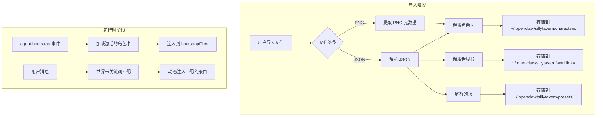
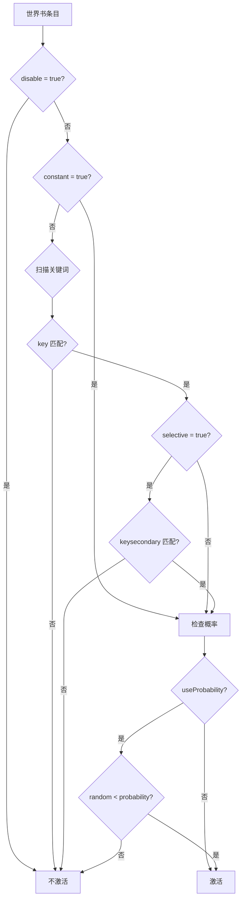
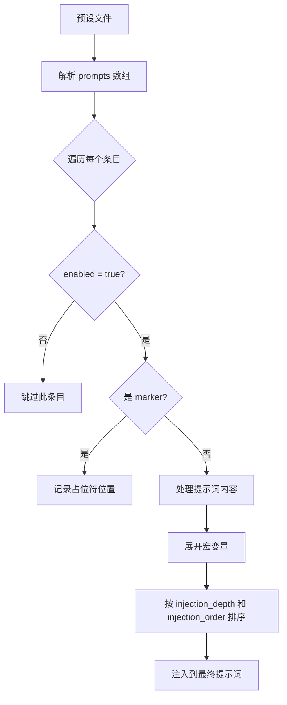
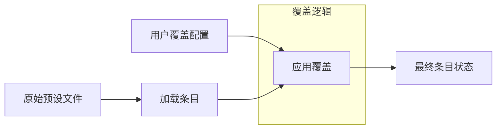

# OpenClaw SillyTavern 扩展插件设计方案

## 概述

本文档描述了为 OpenClaw 添加 SillyTavern 兼容性的扩展插件设计方案。该插件将支持导入和使用 SillyTavern 的三种核心格式：

1. **角色卡 (Character Cards)** - 定义 AI 角色的人格、背景和行为
2. **世界书 (World Info/Lorebook)** - 动态激活的背景知识条目
3. **预设 (Presets)** - 系统提示词模板和采样参数

## 架构设计

### 插件结构

```
extensions/sillytavern/
├── index.ts                    # 插件入口
├── openclaw.plugin.json        # 插件元数据
├── package.json                # 依赖配置
├── src/
│   ├── parsers/
│   │   ├── character-card.ts   # 角色卡解析器 (V1/V2/V3 格式)
│   │   ├── world-info.ts       # 世界书解析器
│   │   ├── preset.ts           # 预设解析器
│   │   └── png-metadata.ts     # PNG 嵌入式元数据提取
│   ├── hooks/
│   │   ├── bootstrap-hook.ts   # agent:bootstrap 事件处理
│   │   └── message-hook.ts     # 消息处理 hook (世界书激活)
│   ├── storage/
│   │   ├── character-store.ts  # 角色卡存储管理
│   │   ├── worldinfo-store.ts  # 世界书存储管理
│   │   └── preset-store.ts     # 预设存储管理
│   ├── cli/
│   │   └── commands.ts         # CLI 命令 (import/list/activate)
│   └── types.ts                # 类型定义
└── tests/
    └── *.test.ts               # 测试文件
```

### 数据流架构



## SillyTavern 格式规范

### 1. 角色卡格式 (Character Card V2/V3) - 完整结构

基于实际的 SillyTavern 角色卡文件分析（支持 V2 和 V3）：

```typescript
// 嵌入式世界书条目
interface CharacterBookEntry {
  keys: string[]; // 触发关键词
  content: string; // 条目内容
  extensions: Record<string, unknown>;
  enabled: boolean; // 是否启用
  insertion_order: number; // 插入顺序
  name: string; // 条目名称
}

// 嵌入式世界书
interface CharacterBook {
  extensions: Record<string, unknown>;
  entries: CharacterBookEntry[];
}

// 深度提示词扩展
interface DepthPromptExtension {
  prompt: string;
  depth: number;
  role: "system" | "user" | "assistant";
}

// 扩展字段
interface CharacterExtensions {
  fav?: boolean; // 是否收藏
  talkativeness?: string; // 话痨程度 (0-1)
  world?: string; // 关联的世界书名称
  depth_prompt?: DepthPromptExtension; // 深度提示词
  [key: string]: unknown; // 其他扩展
}

// 角色卡数据 (V2/V3 通用)
interface CharacterCardData {
  name: string; // 角色名称
  description: string; // 角色描述/外貌/背景
  personality: string; // 性格特征摘要
  scenario: string; // 场景设定
  first_mes: string; // 首条消息/开场白
  mes_example: string; // 对话示例
  creator_notes: string; // 创作者备注 (不注入提示词)
  system_prompt: string; // 系统提示词 (核心指令)
  post_history_instructions: string; // 历史后指令 (jailbreak)
  alternate_greetings: string[]; // 备选问候语
  tags: string[]; // 标签
  creator: string; // 创作者
  character_version: string; // 版本号
  character_book?: CharacterBook; // 嵌入式世界书 (角色专属)
  extensions: CharacterExtensions; // 扩展字段
}

// 完整的角色卡结构 (V3)
interface CharacterCardV3 {
  spec: "chara_card_v3";
  spec_version: "3.0";
  data: CharacterCardData;

  // V3 在根级别也保留了兼容字段
  fav?: boolean;
  name: string;
  description: string;
  personality: string;
  scenario: string;
  first_mes: string;
  mes_example: string;
  tags: string[];
  create_date: string; // ISO 8601 创建时间
  avatar: string; // 头像 (base64 或 "none")
  creatorcomment: string; // 创作者评论
  talkativeness: string; // 话痨程度
}

// V2 格式 (较简单)
interface CharacterCardV2 {
  spec: "chara_card_v2";
  spec_version: "2.0";
  data: CharacterCardData;
}

// 统一类型
type CharacterCard = CharacterCardV2 | CharacterCardV3;
```

**角色卡字段用途说明：**

| 字段                        | 用途                 | 注入位置              |
| --------------------------- | -------------------- | --------------------- |
| `description`               | 角色外貌、背景、设定 | 系统提示词            |
| `personality`               | 性格摘要             | 系统提示词            |
| `scenario`                  | 场景/情境设定        | 系统提示词            |
| `system_prompt`             | 核心行为指令         | 系统提示词开头        |
| `first_mes`                 | 开场白               | 首条 assistant 消息   |
| `mes_example`               | 对话风格示例         | 系统提示词或 few-shot |
| `post_history_instructions` | 行为强化/jailbreak   | 聊天历史后            |
| `character_book`            | 角色专属世界书       | 动态激活              |

### 2. 世界书格式 (World Info) - 完整结构

基于实际的 SillyTavern 世界书文件分析：

```typescript
// 角色过滤器
interface CharacterFilter {
  isExclude: boolean; // 是否为排除模式
  names: string[]; // 角色名称列表
  tags: string[]; // 标签列表
}

// 世界书条目 - 完整字段
interface WorldInfoEntry {
  uid: number; // 唯一标识符
  key: string[]; // 主要触发关键词
  keysecondary: string[]; // 次要关键词 (用于 selective 模式)
  comment: string; // 条目名称/注释 (显示用)
  content: string; // 条目内容 (实际注入的文本)

  // 激活控制
  constant: boolean; // 始终激活 (无需关键词匹配)
  selective: boolean; // 选择性激活 (需要主+次关键词同时匹配)
  selectiveLogic: number; // 选择性逻辑 (0=AND, 1=OR, 等)
  disable: boolean; // 是否禁用此条目

  // 概率控制
  probability: number; // 激活概率 (0-100)
  useProbability: boolean; // 是否使用概率

  // 位置和顺序
  order: number; // 插入顺序优先级
  position: number; // 插入位置 (0=before char, 1=after char, 等)
  depth: number; // 注入深度 (相对于聊天历史)
  displayIndex: number; // 显示顺序

  // 扫描设置
  scanDepth: number | null; // 扫描消息数量 (null=使用全局设置)
  caseSensitive: boolean | null; // 大小写敏感
  matchWholeWords: boolean | null; // 全词匹配

  // 递归控制
  excludeRecursion: boolean; // 排除递归扫描
  preventRecursion: boolean; // 阻止递归
  delayUntilRecursion: boolean; // 延迟到递归时激活

  // 分组
  group: string; // 分组名称
  groupOverride: boolean; // 覆盖分组设置
  groupWeight: number; // 分组权重
  useGroupScoring: boolean | null; // 使用分组评分

  // 匹配范围
  matchPersonaDescription: boolean; // 匹配用户角色描述
  matchCharacterDescription: boolean; // 匹配角色描述
  matchCharacterPersonality: boolean; // 匹配角色性格
  matchCharacterDepthPrompt: boolean; // 匹配角色深度提示
  matchScenario: boolean; // 匹配场景
  matchCreatorNotes: boolean; // 匹配创作者备注

  // 高级设置
  role: number | null; // 消息角色 (null=system, 0=system, 1=user, 2=assistant)
  vectorized: boolean; // 是否已向量化
  automationId: string; // 自动化 ID
  sticky: number; // 粘性 (激活后保持的轮数)
  cooldown: number; // 冷却时间
  delay: number; // 延迟激活
  ignoreBudget: boolean; // 忽略 token 预算

  // 触发器和过滤器
  triggers: string[]; // 额外触发器
  characterFilter: CharacterFilter; // 角色过滤器
  outletName: string; // 输出名称
  addMemo: boolean; // 添加备注
}

// 世界书结构
interface WorldInfoBook {
  entries: Record<string, WorldInfoEntry>; // 条目字典 (key 为 uid 字符串)
  // 可能还有其他元数据字段
}
```

**条目激活逻辑详解：**



### 3. 预设格式 (Preset) - 完整结构

SillyTavern 预设实际上是一个复杂的提示词编排系统，包含多个可独立启用/禁用的条目：

```typescript
// 预设中的单个提示词条目
interface PresetPromptEntry {
  identifier: string; // 唯一标识符 (UUID 或预定义如 main, jailbreak)
  name: string; // 显示名称
  enabled: boolean; // 是否启用此条目
  role: "system" | "user" | "assistant"; // 消息角色
  content: string; // 提示词内容 (支持宏变量)

  // 注入控制
  injection_position: number; // 注入位置 (0=相对于系统提示词)
  injection_depth: number; // 注入深度 (相对于聊天历史末尾的消息数)
  injection_order: number; // 同深度条目的排序优先级

  // 特殊标记
  system_prompt: boolean; // 是否作为系统提示词的一部分
  marker: boolean; // 是否为占位符标记 (如 worldInfoBefore)
  forbid_overrides: boolean; // 禁止被覆盖

  // 触发条件 (可选)
  injection_trigger?: string[]; // 触发关键词
}

// 预定义的标记条目 (marker: true)
type MarkerIdentifier =
  | "worldInfoBefore" // 世界书 (前置)
  | "worldInfoAfter" // 世界书 (后置)
  | "personaDescription" // 用户角色描述
  | "charDescription" // 角色描述
  | "charPersonality" // 角色性格
  | "scenario" // 场景设定
  | "dialogueExamples" // 对话示例
  | "chatHistory"; // 聊天历史

// 完整的预设结构
interface SillyTavernPreset {
  // 采样参数
  temperature: number;
  frequency_penalty: number;
  presence_penalty: number;
  top_p: number;
  top_k: number;
  top_a: number;
  min_p: number;
  repetition_penalty: number;
  openai_max_context: number;
  openai_max_tokens: number;

  // 提示词条目列表 (核心!)
  prompts: PresetPromptEntry[];

  // 格式模板
  wi_format: string; // 世界书格式 (如 "{0}")
  scenario_format: string; // 场景格式 (如 "{{scenario}}")
  personality_format: string; // 性格格式 (如 "{{personality}}")

  // 特殊提示词
  impersonation_prompt: string; // 扮演用户的提示词
  new_chat_prompt: string; // 新对话提示词
  new_group_chat_prompt: string; // 新群聊提示词
  continue_nudge_prompt: string; // 继续生成提示词
  group_nudge_prompt: string; // 群聊轮次提示词

  // 其他设置
  stream_openai: boolean;
  wrap_in_quotes: boolean;
  names_behavior: number;
  send_if_empty: string;
  bias_preset_selected: string;
  max_context_unlocked: boolean;
}
```

### 4. 预设条目启用/禁用机制

预设中的每个条目都可以独立控制：



**条目类型说明：**

| 类型     | marker | system_prompt | 用途                        |
| -------- | ------ | ------------- | --------------------------- |
| 普通条目 | false  | false         | 用户自定义的提示词片段      |
| 系统条目 | false  | true          | 作为系统提示词的一部分      |
| 占位符   | true   | true          | 标记角色卡/世界书的插入位置 |

### 5. 宏变量系统

预设支持丰富的宏变量，需要在运行时展开：

```typescript
interface MacroContext {
  user: string; // 用户名 ({{user}})
  char: string; // 角色名 ({{char}})
  lastUserMessage: string; // 最后一条用户消息
  // 变量存储
  variables: Map<string, string>;
}

// 支持的宏
const SUPPORTED_MACROS = [
  "{{user}}", // 用户名
  "{{char}}", // 角色名
  "{{lastUserMessage}}", // 最后用户消息
  "{{scenario}}", // 场景设定
  "{{personality}}", // 角色性格
  "{{random::a::b::c}}", // 随机选择
  "{{setvar::name::value}}", // 设置变量
  "{{getvar::name}}", // 获取变量
  "{{// comment}}", // 注释 (会被移除)
];
```

## 集成点设计

### 1. Bootstrap Hook 集成

插件通过 `agent:bootstrap` 事件将角色卡内容注入到系统提示词：

```typescript
// src/hooks/bootstrap-hook.ts
import type { OpenClawPluginApi } from "openclaw/plugin-sdk";

export function registerBootstrapHook(api: OpenClawPluginApi) {
  api.on("agent:bootstrap", async (event) => {
    const context = event.context;
    const config = api.config;

    // 获取当前激活的角色卡
    const activeCharacter = await getActiveCharacter(config);
    if (!activeCharacter) return;

    // 构建角色卡内容
    const characterContent = buildCharacterPrompt(activeCharacter);

    // 注入到 bootstrapFiles (替换或增强 SOUL.md)
    const soulIndex = context.bootstrapFiles.findIndex((f) => f.name === "SOUL.md");

    if (soulIndex >= 0) {
      // 合并到现有 SOUL.md
      context.bootstrapFiles[soulIndex].content =
        characterContent + "\n\n" + (context.bootstrapFiles[soulIndex].content ?? "");
    } else {
      // 添加新的角色文件
      context.bootstrapFiles.push({
        name: "CHARACTER.md",
        path: "~/.openclaw/sillytavern/active-character.md",
        content: characterContent,
        missing: false,
      });
    }
  });
}
```

### 2. 世界书动态激活

世界书条目需要在每次消息处理时动态匹配和注入：

```typescript
// src/hooks/message-hook.ts
export function registerMessageHook(api: OpenClawPluginApi) {
  api.on("before_agent_start", async (event) => {
    const { messages, config } = event.context;

    // 获取激活的世界书
    const worldBooks = await getActiveWorldBooks(config);
    if (worldBooks.length === 0) return;

    // 收集最近的消息文本用于关键词匹配
    const recentText = collectRecentMessages(messages, {
      depth: config.sillytavern?.worldInfo?.scanDepth ?? 5,
    });

    // 匹配世界书条目
    const matchedEntries = matchWorldInfoEntries(worldBooks, recentText);

    // 注入匹配的条目到系统提示词
    if (matchedEntries.length > 0) {
      event.context.prependContext = buildWorldInfoContext(matchedEntries);
    }
  });
}
```

### 3. CLI 命令设计

```bash
# 角色卡管理
openclaw sillytavern character import <file>     # 导入角色卡
openclaw sillytavern character list              # 列出所有角色卡
openclaw sillytavern character activate <name>   # 激活角色卡
openclaw sillytavern character deactivate        # 停用当前角色卡
openclaw sillytavern character show <name>       # 显示角色卡详情
openclaw sillytavern character delete <name>     # 删除角色卡

# 世界书管理
openclaw sillytavern worldinfo import <file>     # 导入世界书
openclaw sillytavern worldinfo list              # 列出所有世界书
openclaw sillytavern worldinfo enable <name>     # 启用世界书
openclaw sillytavern worldinfo disable <name>    # 禁用世界书
openclaw sillytavern worldinfo show <name>       # 显示世界书详情
openclaw sillytavern worldinfo entry <book> list           # 列出世界书条目
openclaw sillytavern worldinfo entry <book> enable <uid>   # 启用条目
openclaw sillytavern worldinfo entry <book> disable <uid>  # 禁用条目

# 预设管理 (支持条目级别控制)
openclaw sillytavern preset import <file>        # 导入预设
openclaw sillytavern preset list                 # 列出所有预设
openclaw sillytavern preset activate <name>      # 激活预设
openclaw sillytavern preset deactivate           # 停用当前预设
openclaw sillytavern preset show <name>          # 显示预设详情
openclaw sillytavern preset delete <name>        # 删除预设

# 预设条目管理
openclaw sillytavern preset entry <preset> list              # 列出预设中的所有条目
openclaw sillytavern preset entry <preset> enable <id>       # 启用指定条目
openclaw sillytavern preset entry <preset> disable <id>      # 禁用指定条目
openclaw sillytavern preset entry <preset> toggle <id>       # 切换条目状态
openclaw sillytavern preset entry <preset> reset             # 重置为原始启用状态

# 快捷命令
openclaw sillytavern status                      # 显示当前激活状态
openclaw sillytavern sync                        # 从 SillyTavern 目录同步

# 预设管理
openclaw sillytavern preset import <file>        # 导入预设
openclaw sillytavern preset list                 # 列出所有预设
openclaw sillytavern preset activate <name>      # 激活预设
openclaw sillytavern preset show <name>          # 显示预设详情
```

## 配置 Schema

```typescript
// 预设条目覆盖配置
interface PresetEntryOverride {
  identifier: string; // 条目标识符
  enabled?: boolean; // 覆盖启用状态
}

// 世界书条目覆盖配置
interface WorldInfoEntryOverride {
  uid: number; // 条目 UID
  disabled?: boolean; // 覆盖禁用状态
}

// 世界书配置
interface WorldInfoBookConfig {
  bookId: string; // 世界书 ID
  enabled: boolean; // 是否启用此世界书
  entryOverrides?: WorldInfoEntryOverride[]; // 条目级别覆盖
}

// 预设配置
interface PresetConfig {
  presetId: string; // 预设 ID
  entryOverrides?: PresetEntryOverride[]; // 条目级别覆盖
}

// 插件配置 schema
interface SillyTavernPluginConfig {
  // 角色卡设置
  character?: {
    active?: string; // 当前激活的角色卡名称
    mergeWithSoul?: boolean; // 是否与 SOUL.md 合并 (默认: true)
    includeExamples?: boolean; // 是否包含对话示例 (默认: true)
    includeScenario?: boolean; // 是否包含场景设定 (默认: true)
    includeFirstMessage?: boolean; // 是否包含首条消息 (默认: false)
  };

  // 世界书设置
  worldInfo?: {
    enabled?: boolean; // 是否启用世界书 (默认: true)
    books?: WorldInfoBookConfig[]; // 世界书配置列表 (支持条目级别覆盖)
    scanDepth?: number; // 扫描消息深度 (默认: 5)
    maxEntries?: number; // 最大激活条目数 (默认: 10)
    maxTokens?: number; // 最大 token 数 (默认: 2000)
    budgetCap?: number; // token 预算上限
    recursiveScan?: boolean; // 是否递归扫描 (默认: true)
  };

  // 预设设置
  preset?: {
    active?: string; // 当前激活的预设名称
    config?: PresetConfig; // 预设配置 (包含条目覆盖)
    applySystemPrompt?: boolean; // 是否应用系统提示词 (默认: true)
    applySamplingParams?: boolean; // 是否应用采样参数 (默认: false)
    applyMacros?: boolean; // 是否展开宏变量 (默认: true)
  };

  // 宏变量设置
  macros?: {
    user?: string; // {{user}} 的值 (默认: 用户配置的名称)
    customVariables?: Record<string, string>; // 自定义变量
  };
}
```

### 条目覆盖机制

用户可以在不修改原始文件的情况下，覆盖预设或世界书中特定条目的启用状态：



**示例配置：**

```json
{
  "plugins": {
    "sillytavern": {
      "preset": {
        "active": "小猫之神",
        "config": {
          "presetId": "xiaomao-3.10",
          "entryOverrides": [
            { "identifier": "5e89beb6-bcb8-4854-af27-49dcb2e6292a", "enabled": true },
            { "identifier": "d6fa9105-b1ec-4079-a3be-a608388a4812", "enabled": false }
          ]
        }
      }
    }
  }
}
```

## 存储结构

```
~/.openclaw/sillytavern/
├── characters/
│   ├── index.json                   # 角色卡索引
│   ├── <character-id>.json          # 角色卡数据
│   └── <character-id>.png           # 原始 PNG (如果有)
├── worldinfo/
│   ├── index.json                   # 世界书索引
│   └── <book-id>.json               # 世界书数据
├── presets/
│   ├── index.json                   # 预设索引
│   └── <preset-id>.json             # 预设数据
└── config.json                      # 插件配置
```

## 与现有系统的兼容性

### SOUL.md 兼容

- 角色卡内容可以与现有 SOUL.md 合并或替换
- 用户可以选择优先级：角色卡优先 vs SOUL.md 优先
- 支持在 SOUL.md 中引用角色卡变量

### Bootstrap 系统兼容

- 通过 `agent:bootstrap` hook 无缝集成
- 不修改核心 bootstrap 逻辑
- 支持与其他 hooks (如 soul-evil) 协同工作

### 配置系统兼容

- 使用标准的 OpenClaw 配置路径
- 支持通过 `openclaw config set` 修改设置
- 配置变更实时生效

## 实现优先级

### Phase 1: 基础功能

1. 角色卡解析器 (V2 格式)
2. 角色卡导入和存储
3. Bootstrap hook 集成
4. 基础 CLI 命令

### Phase 2: 世界书支持

1. 世界书解析器
2. 关键词匹配引擎
3. 动态注入机制
4. 世界书 CLI 命令

### Phase 3: 预设和高级功能

1. 预设解析器
2. PNG 元数据提取
3. 角色卡 V3 格式支持
4. 向量化世界书搜索 (可选)

## 技术考虑

### 性能优化

- 世界书条目预编译正则表达式
- 使用 LRU 缓存减少文件 I/O
- 异步加载非关键数据

### 安全考虑

- 验证导入文件的格式和大小
- 清理潜在的注入攻击内容
- 限制世界书条目的最大长度

### 测试策略

- 单元测试：解析器、匹配器
- 集成测试：hook 集成、CLI 命令
- 使用真实的 SillyTavern 导出文件进行兼容性测试
