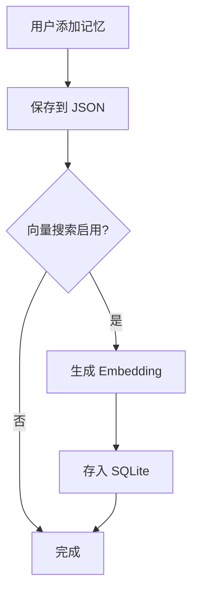
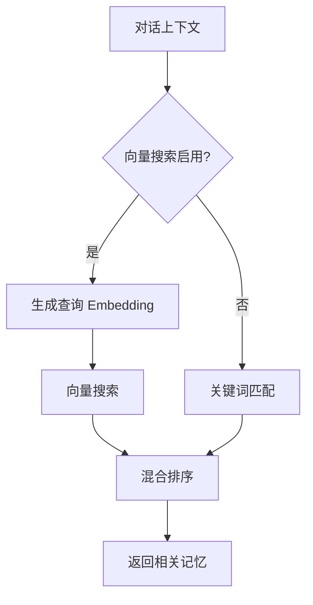
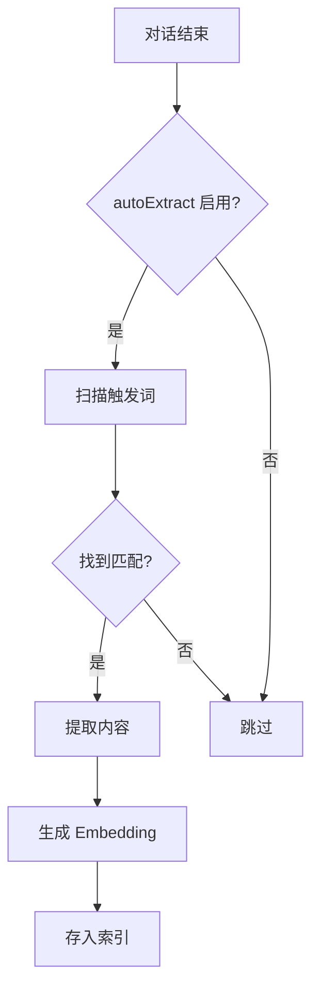

# SillyTavern Memory 向量化改造设计方案

## 目标

将 SillyTavern 插件的 memory 系统从简单的关键词匹配改造为基于向量嵌入的语义搜索系统，同时保持与 OpenClaw 核心 memory 系统的独立性。

## 当前架构分析

### OpenClaw 核心 Memory 系统
- **存储**: SQLite + 向量索引
- **位置**: `~/.openclaw/agents/<agentId>/index.sqlite`
- **数据源**: `MEMORY.md` 或 `memory/` 目录下的 markdown 文件
- **Embedding**: 支持 OpenAI/Voyage/Gemini/Local
- **搜索**: 混合搜索 (向量 + FTS)

### SillyTavern 当前 Memory 系统
- **存储**: JSON 文件
- **位置**: `~/.openclaw/plugins/sillytavern/memories/`
- **数据源**: 手动添加或触发词提取
- **搜索**: 简单关键词匹配

## 改造方案

### 设计原则
1. **独立性**: 与 OpenClaw 核心 memory 完全独立，有自己的 SQLite 索引
2. **复用性**: 复用 OpenClaw 的 embedding provider 基础设施
3. **角色绑定**: 每个角色/会话有独立的 memory 索引
4. **向后兼容**: 保留现有 JSON 格式，支持迁移

### 新架构

```
~/.openclaw/plugins/sillytavern/
├── memories/
│   ├── {bookId}.json          # 元数据 + 原始记忆条目
│   └── {bookId}.sqlite        # 向量索引
```

### 核心组件

#### 1. VectorMemoryStore

新增 `extensions/sillytavern/src/memory/vector-store.ts`:

```typescript
interface VectorMemoryStore {
  // 初始化/获取索引
  getOrCreateIndex(bookId: string): Promise<MemoryVectorIndex>;
  
  // 添加记忆并生成 embedding
  addMemoryWithEmbedding(bookId: string, entry: MemoryEntry): Promise<void>;
  
  // 向量搜索
  searchSimilar(bookId: string, query: string, opts?: SearchOptions): Promise<MemorySearchResult[]>;
  
  // 同步 JSON 到向量索引
  syncFromJson(bookId: string): Promise<void>;
  
  // 关闭索引
  close(bookId: string): Promise<void>;
}
```

#### 2. MemoryVectorIndex

每个 memory book 的向量索引管理器:

```typescript
interface MemoryVectorIndex {
  // 索引单条记忆
  indexEntry(entry: MemoryEntry): Promise<void>;
  
  // 批量索引
  indexBatch(entries: MemoryEntry[]): Promise<void>;
  
  // 向量搜索
  search(queryEmbedding: number[], limit: number): Promise<ScoredEntry[]>;
  
  // 混合搜索 (向量 + 关键词)
  hybridSearch(query: string, queryEmbedding: number[], limit: number): Promise<ScoredEntry[]>;
  
  // 删除条目
  removeEntry(entryId: string): Promise<void>;
  
  // 状态
  status(): IndexStatus;
}
```

#### 3. EmbeddingManager

复用 OpenClaw 的 embedding 基础设施:

```typescript
interface SillyTavernEmbeddingManager {
  // 获取 embedding provider
  getProvider(): Promise<EmbeddingProvider>;
  
  // 生成单条 embedding
  embed(text: string): Promise<number[]>;
  
  // 批量生成
  embedBatch(texts: string[]): Promise<number[][]>;
}
```

### 数据库 Schema

```sql
-- 记忆条目表
CREATE TABLE entries (
  id TEXT PRIMARY KEY,
  content TEXT NOT NULL,
  created_at TEXT NOT NULL,
  importance INTEGER DEFAULT 50,
  category TEXT,
  keywords TEXT,  -- JSON array
  enabled INTEGER DEFAULT 1
);

-- 向量索引表
CREATE TABLE vectors (
  entry_id TEXT PRIMARY KEY,
  embedding BLOB NOT NULL,
  model TEXT NOT NULL,
  FOREIGN KEY (entry_id) REFERENCES entries(id)
);

-- FTS 全文搜索
CREATE VIRTUAL TABLE entries_fts USING fts5(
  content,
  keywords,
  content=entries,
  content_rowid=rowid
);

-- 元数据
CREATE TABLE meta (
  key TEXT PRIMARY KEY,
  value TEXT
);
```

### 配置 Schema 更新

```typescript
interface SillyTavernMemoryConfig {
  enabled?: boolean;
  
  // 向量搜索配置
  vector?: {
    enabled?: boolean;
    provider?: 'openai' | 'voyage' | 'gemini' | 'local' | 'auto';
    model?: string;
    fallback?: 'openai' | 'gemini' | 'local' | 'voyage' | 'none';
  };
  
  // 搜索配置
  search?: {
    maxResults?: number;
    minScore?: number;
    hybridWeight?: number;  // 向量权重 vs 关键词权重
  };
  
  // 自动提取配置
  autoExtract?: boolean;
  extractionTriggers?: string[];
  
  // 注入配置
  maxMemoriesPerRequest?: number;
  maxMemoryTokens?: number;
  minImportance?: number;
  sortBy?: 'importance' | 'recency' | 'relevance';
}
```

### 工作流程

#### 添加记忆



#### 检索记忆



#### 自动提取



## 实现步骤

### Phase 1: 基础设施
1. 创建 `vector-store.ts` - 向量存储管理
2. 创建 `embedding-manager.ts` - embedding 管理
3. 创建 `memory-index.ts` - SQLite 索引管理

### Phase 2: 核心功能
4. 修改 `store.ts` - 集成向量存储
5. 实现混合搜索算法
6. 添加 JSON 到向量索引的迁移功能

### Phase 3: 集成
7. 修改 `bootstrap-hook.ts` - 使用向量搜索
8. 更新 `config-schema.ts` - 新配置项
9. 更新 CLI 命令

### Phase 4: 测试和文档
10. 编写单元测试
11. 编写集成测试
12. 更新文档

## 文件变更清单

### 新增文件
- `extensions/sillytavern/src/memory/vector-store.ts`
- `extensions/sillytavern/src/memory/embedding-manager.ts`
- `extensions/sillytavern/src/memory/memory-index.ts`
- `extensions/sillytavern/src/memory/hybrid-search.ts`
- `extensions/sillytavern/src/memory/vector-store.test.ts`

### 修改文件
- `extensions/sillytavern/src/memory/store.ts` - 集成向量存储
- `extensions/sillytavern/src/memory/types.ts` - 新类型定义
- `extensions/sillytavern/src/hooks/bootstrap-hook.ts` - 使用向量搜索
- `extensions/sillytavern/src/config-schema.ts` - 新配置项
- `extensions/sillytavern/src/cli/commands.ts` - 新命令

## 风险和注意事项

1. **Embedding API 依赖**: 需要配置 embedding provider，否则回退到关键词搜索
2. **存储空间**: 向量索引会增加存储占用
3. **性能**: 首次索引可能较慢，需要显示进度
4. **迁移**: 需要提供从旧 JSON 格式迁移的工具

## 与 OpenClaw 核心 Memory 的区别

| 特性       | OpenClaw 核心 | SillyTavern    |
| ---------- | ------------- | -------------- |
| 数据源     | Markdown 文件 | 结构化记忆条目 |
| 索引位置   | Agent 目录    | 插件目录       |
| 绑定对象   | Agent         | 角色/会话      |
| 自动提取   | 无            | 支持触发词     |
| 重要性评分 | 无            | 支持           |
| 分类标签   | 无            | 支持           |
